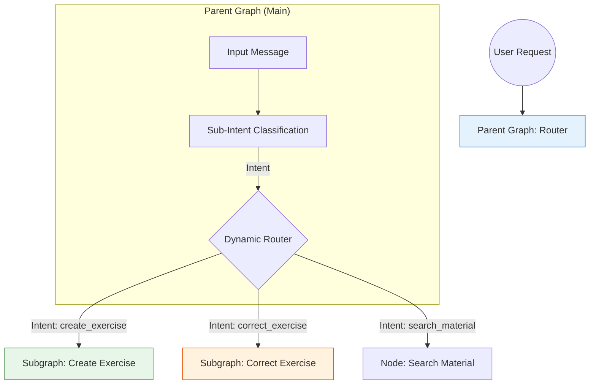
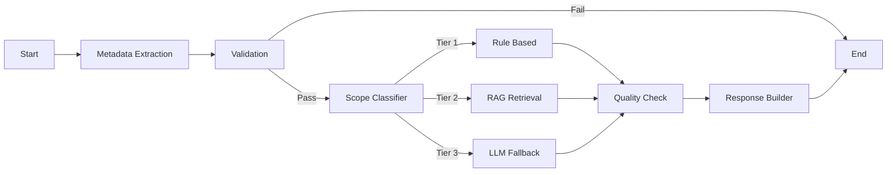
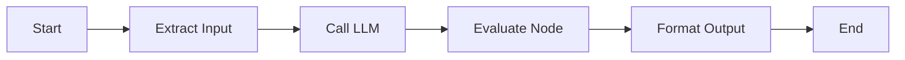

# Kiến trúc Hệ thống Agent Giáo dục

Tài liệu này tổng hợp toàn bộ kiến trúc xử lý của Agent, từ khi nhận đầu vào của người dùng cho đến khi điều phối xuống các Subgraph chuyên biệt là `create_exercise` (Tạo bài tập) và `correct_exercise` (Chấm/Chữa bài tập).

## 1. Tổng quan Luồng xử lý (Data Flow)

Hệ thống hoạt động theo mô hình phân cấp (Hierarchical Graph). Một Graph cha (Main Graph) đứng đầu để phân loại và định tuyến, sau đó chuyển giao cho các Graph con (Subgraphs) thực hiện nhiệm vụ cụ thể.

---

## 2. Parent Graph (Cơ chế Định tuyến Trung tâm)

**Nhiệm vụ**: Tiếp nhận yêu cầu tự nhiên, hiểu ý định và chuyển hướng.

### Quy trình:
1.  **Input**: Tin nhắn chat của người dùng (Text/Image).
2.  **Sub-Intent Classification**: 
    *   Sử dụng LLM để phân tích ngữ nghĩa.
    *   Xác định `sub_intent` (Ví dụ: Người dùng muốn "tạo bài tập toán" hay "giải bài toán này").
3.  **Routing**:
    *   Dựa trên `sub_intent`, Graph Cha sẽ kích hoạt Subgraph tương ứng.

---

## 3. Subgraph: Create Exercise (Tạo bài tập)

**Nhiệm vụ**: Sinh bài tập mới theo chủ đề, lớp học, độ khó yêu cầu.

### Cơ chế chi tiết:
1.  **Metadata Extraction**: Trích xuất entities (Môn, Lớp, Chủ đề).
2.  **Validation**: Kiểm tra xem đủ thông tin để tạo chưa.
3.  **Scope Classifier (Phân loại độ khó)**:
    *   **Tier 1**: Bài tập cơ bản -> Dùng `RuleBasedNode`.
    *   **Tier 2**: Bài tập cần dữ liệu thực tế -> Dùng `RAGNode` (Truy xuất Vector DB/Sách GK).
    *   **Tier 3**: Bài tập phức tạp/sáng tạo -> Dùng `LLMFallbackNode` (LLM tự suy luận).
4.  **Generation**: Sinh nội dung bài tập theo JSON format.
5.  **Quality Check**: Kiểm tra tính hợp lệ của JSON và nội dung.

---

## 4. Subgraph: Correct Exercise (Chấm/Chữa bài)

**Nhiệm vụ**: Giải bài tập, chấm điểm hoặc hướng dẫn học sinh.

### Cơ chế chi tiết:
1.  **Extract Input**: 
    *   Đọc hiểu đề bài từ Text hoặc OCR từ ảnh chụp bài tập.
2.  **Call LLM (Giáo viên AI)**:
    *   **Model**: Sử dụng LLM với cấu hình `max_tokens=4096`.
    *   **Role**: Giải bài tập từng bước, giải thích chi tiết.
    *   **Cơ chế**: Trực tiếp giải dựa trên kiến thức mô hình (đã loại bỏ bước tra cứu lịch sử cũ để tối ưu tốc độ).
3.  **Evaluate Node (QA/Reviewer)**:
    *   **Nhiệm vụ**: Đánh giá lời giải của "Giáo viên AI" trước khi gửi cho học sinh.
    *   **Kiểm tra**: Tính chính xác toán học, Logic, Chính tả/Ngữ pháp tiếng Việt.
    *   **Hành động**: Nếu sai -> Tự động sửa lại. Nếu đúng -> Thông qua.
4.  **Format Output**: Đóng gói câu trả lời cuối cùng.

---

## 5. Công nghệ & Model Sử dụng

| Thành phần | Công nghệ / Model | Mô tả |
| :--- | :--- | :--- |
| **Orchestration** | **LangGraph** | Quản lý luồng trạng thái (State Management) cho các node. Cho phép xây dựng quy trình phức tạp có rẽ nhánh, vòng lặp. |
| **LLM Inference** | **LangChain** | Framework kết nối ứng dụng với LLM. |
| **Model Chính** | **Google Gemini Pro** (via Vertex AI) | Sử dụng cho các tác vụ: Phân loại ý định, Sinh bài tập, Giải toán, Reviewer. |
| **Prompt Engineering** | **System Prompts** | Các node đều có prompt chuyên biệt (Persona) cho từng vai trò: Router, Teacher, QA Reviewer. |
| **Memory** | **In-memory store** | Lưu trữ ngữ cảnh hội thoại ngắn hạn và lịch sử bài tập phiên làm việc. |
