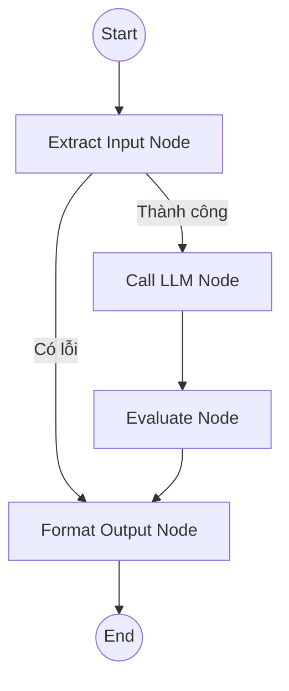

# Correct Exercise Subgraph - Chi tiết Kỹ thuật

Tài liệu này mô tả chi tiết quy trình, logic xử lý và cơ chế của **Correct Exercise Subgraph** (Service chấm/chữa bài).

## 1. Luồng hoạt động (Workflow)



### Chi tiết các Node:

1.  **Extract Input Node**:
    *   **Nhiệm vụ**: Chuẩn hóa dữ liệu đầu vào.
    *   **Xử lý Đa phương thức (Multimodal)**:
        *   Nếu đầu vào là **Text**: Lấy trực tiếp nội dung.
        *   Nếu đầu vào là **Ảnh (Image URL)**: Gọi Vision LLM (với prompt OCR Expert) để trích xuất chữ viết, công thức toán học từ ảnh.
    *   **Error Handling**: Nếu không trích xuất được nội dung (ảnh mờ, text rỗng), trả về lỗi ngay lập tức.

2.  **Call LLM Node (Giáo viên AI)**:
    *   **Nhiệm vụ**: Giải bài toán và đưa ra lời giải thích chi tiết.
    *   **Persona**: Đóng vai giáo viên giỏi, giải thích cặn kẽ từng bước (Step-by-step reasoning).
    *   **Cấu hình**: `max_tokens=4096` để đảm bảo không bị cắt cụt với các bài giải dài.

3.  **Evaluate Node (QA Reviewer)**:
    *   **Nhiệm vụ**: Thẩm định chất lượng lời giải của node trước.
    *   **Logic Review**:
        *   Kiểm tra tính chính xác của kết quả toán học.
        *   Kiểm tra lỗi chính tả/ngữ pháp tiếng Việt.
        *   Kiểm tra độ rõ ràng của lời giải.
    *   **Tự động sửa chữa**: Nếu phát hiện lỗi, node này sẽ tự động viết lại lời giải đúng/hay hơn thay vì chỉ báo lỗi.

4.  **Format Output Node**:
    *   **Nhiệm vụ**: Đóng gói kết quả cuối cùng thành format chuẩn để trả về cho Client.

## 2. Các kịch bản Lỗi & Xử lý Exception

Trong Subgraph này, lỗi chủ yếu xuất phát từ quá trình xử lý đầu vào hoặc gọi model.

| Mã lỗi/Tình huống | Mô tả | Hành động của Hệ thống |
| :--- | :--- | :--- |
| **Empty Input** | Không trích xuất được nội dung từ Text hoặc Ảnh xử lý OCR thất bại. | Trả message: *"Xin lỗi, tôi không đọc được nội dung câu hỏi. Vui lòng thử lại."* và kết thúc Flow. |
| **Vision Error** | Lỗi khi gọi Vision API (ảnh lỗi, network error). | Log warning, cố gắng xử lý phần text còn lại (nếu có). |
| **LLM Error** | Model bị quá tải, timeout hoặc lỗi server. | Catch Exception, trả message báo lỗi chung cho người dùng: *"Xin lỗi, đã xảy ra lỗi khi chấm bài tập."* |
| **Evaluation Error** | Node Reviewer gặp sự cố. | Bỏ qua bước Review, trả về kết quả gốc từ bước Call LLM (Fail-open strategy). |

## 3. Cấu hình & Prompting

### 3.1. Extract Input (OCR)
*   **Prompt**: "You are an OCR expert... Extract all text, formulas..."
*   **Model**: Sử dụng model có khả năng Vision (VD: Gemini Pro Vision / GPT-4o).

### 3.2. Call LLM (Solver)
*   **Prompt**: "Bạn là giáo viên nhiệt tình... Hãy giải bài toán sau từng bước một..."
*   **Parameters**:
    *   `temperature`: 0.3 - 0.5 (Cần sự chính xác, ít sáng tạo bay bổng).
    *   `max_tokens`: 4096.

### 3.3. Evaluate (Reviewer)
*   **Prompt**: "Bạn là chuyên gia kiểm định chất lượng giáo dục (QA). Hãy kiểm tra lời giải..."
*   **Logic**: So sánh Output và Input gốc.

## 4. Input / Output Data Format

**Input Payload (hỗ trợ Text và Image):**
```json
{
  "content": [
    { "type": "text", "text": "Giải giúp em bài này với ạ:" },
    { "type": "image_url", "image_url": { "url": "https://..." } }
  ]
}
```

**Output Response:**
```json
{
  "sender": "ai",
  "text": "Dưới đây là lời giải chi tiết cho bài toán của em:\n\n**Bước 1**: ...\n**Bước 2**: ...\n\n**Kết quả**: ...",
  "data_artifacts": {
      "original_text": "...", 
      "evaluation_status": "passed_with_revision" // hoặc "passed"
  }
}
```
