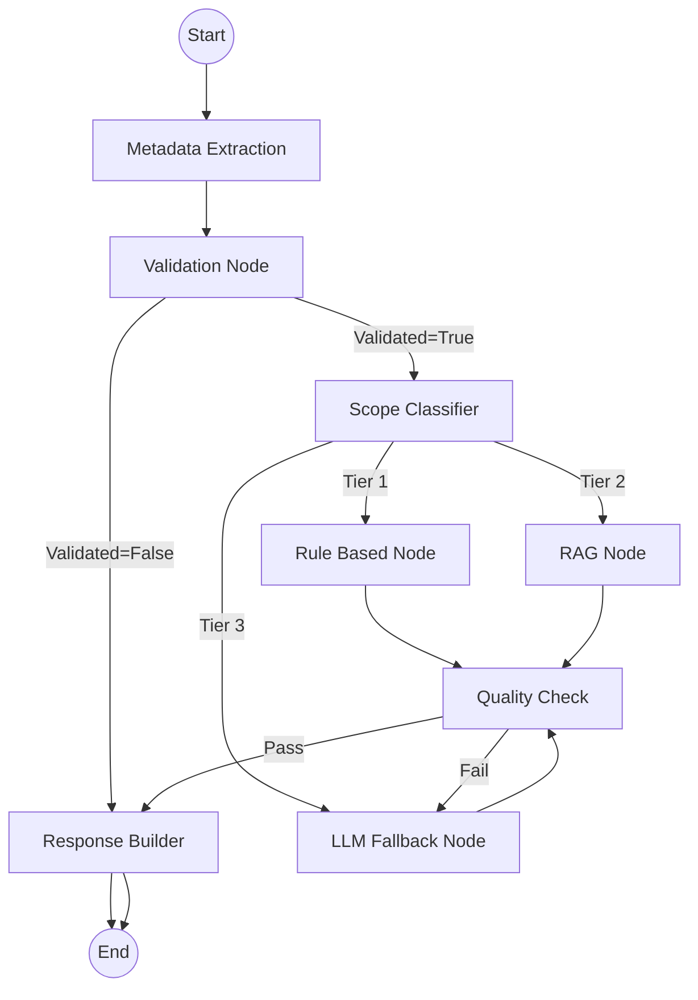

# Create Exercise Subgraph - Chi tiết Kỹ thuật

Tài liệu này mô tả chi tiết quy trình, logic xử lý và mã lỗi của **Create Exercise Subgraph** (Service tạo bài tập).

## 1. Luồng hoạt động (Workflow)



### Chi tiết các Node:

1.  **Metadata Extraction Node**:
    *   **Nhiệm vụ**: Phân tích câu nói tự nhiên của người dùng để rút trích các thực thể entities: `Subject`, `Grade`, `Topic`, `Difficulty`.
    *   **Cơ chế**: Sử dụng LLM với prompt Extract structured data.

2.  **Validation Node**:
    *   **Nhiệm vụ**: Kiểm tra tính hợp lệ của dữ liệu đã trích xuất.
    *   **Logic**:
        *   Kiểm tra trường bắt buộc: Lớp, Môn, Chủ đề.
        *   Kiểm tra tính logic: Môn này có ở lớp này không? (Ví dụ: Lớp 1 chưa có Vật Lý).
        *   Sử dụng bộ nhớ (`ExerciseMemory`) để điền thông tin còn thiếu từ ngữ cảnh trước đó.
    *   **Output**: Nếu thiếu thông tin -> Trả về lỗi yêu cầu bổ sung (`MISSING_INFO`).

3.  **Scope Classifier Node**:
    *   **Nhiệm vụ**: Phân loại độ phức tạp để chọn hướng xử lý (Routing).
    *   **Chiến lược**:
        *   **Tier 1 (Cơ bản)**: Bài tập tính toán mẫu, đơn giản (VD: "Tạo 5 bài cộng 2 số").
        *   **Tier 2 (Nghiên cứu - RAG)**: Cần dữ liệu thực tế hoặc dạng bài chuẩn Sách giáo khoa (VD: "Bài tập về diện tích hình thang SGK Toán 5").
        *   **Tier 3 (Sáng tạo - LLM)**: Yêu cầu phức tạp, giải quyết tình huống (VD: "Bài toán đố vui về con thỏ").

4.  **Generators (Rule/RAG/LLM)**:
    *   Các node này chịu trách nhiệm sinh nội dung bài tập dưới định dạng list objects.

5.  **Quality Check Node**:
    *   **Nhiệm vụ**: Kiểm tra lại bài tập sinh ra.
    *   **Tiêu chí**:
        *   Format JSON có đúng không?
        *   Đáp án có khớp với câu hỏi không?
        *   Ngôn ngữ có thuần Việt không?

## 2. Danh sách Mã lỗi (Error Codes)

Các mã lỗi này được trả về từ **Validation Node** khi thông tin đầu vào không hợp lệ.

| Mã lỗi | Mô tả | Hành động gợi ý cho User |
| :--- | :--- | :--- |
| **MISSING_INFO** | Thiếu thông tin bắt buộc (Lớp, Môn, Chủ đề). | "Vui lòng cho biết thêm [thông tin thiếu]..." |
| **E01** | Chưa xác định được Môn học (Subject). | "Bạn muốn tạo bài tập môn gì?" |
| **E02** | Sự kết hợp Môn - Lớp không hợp lệ (VD: Lý lớp 1). | "Môn [Subject] không có ở Lớp [Grade]. Vui lòng kiểm tra lại." |
| **E03** | Chưa xác định được Lớp học (Grade). | "Bài tập này dành cho lớp mấy?" |
| **E04** | Thiếu cả Lớp và Môn. | "Vui lòng cho biết Lớp và Môn học." |

## 3. Cấu hình & Settings

Các tham số cấu hình chính được lưu trong `config/settings.py` hoặc biến môi trường:

| Key (Env/Setting) | Default | Mô tả |
| :--- | :--- | :--- |
| `DEFAULT_GRADE` | `None` | Lớp mặc định nếu không xác định được. |
| `DEFAULT_SUBJECT` | `None` | Môn mặc định. |
| `ELASTICSEARCH_EXERCISE_INDEX`| `search-math` | Index dùng cho RAG search. |
| `ELASTICSEARCH_EXERCISE_TOP_K`| `5` | Số lượng bài mẫu lấy về làm mẫu (Few-shot). |
| `ELASTICSEARCH_EXERCISE_SIMILARITY_THRESHOLD` | `0.7` | Ngưỡng tương đồng tối thiểu để lấy context. |

## 4. Input / Output Data Format

**Input Payload (từ Client):**
```json
{
  "content": "Tạo bài tập toán lớp 4 về phân số",
  "metadata": {
      "session_id": "uuid..."
  }
}
```

**Output Response (về Client):**
```json
{
  "node_responses": [...], // Text chat
  "data_artifacts": {
      "exercises": [
          {
              "question": "1/2 + 1/3 = ?",
              "answer": "5/6",
              "difficulty": "Dễ"
          }
      ],
      "generation_metadata": {
          "method": "rag",
          "tier": 2
      }
  }
}
```
